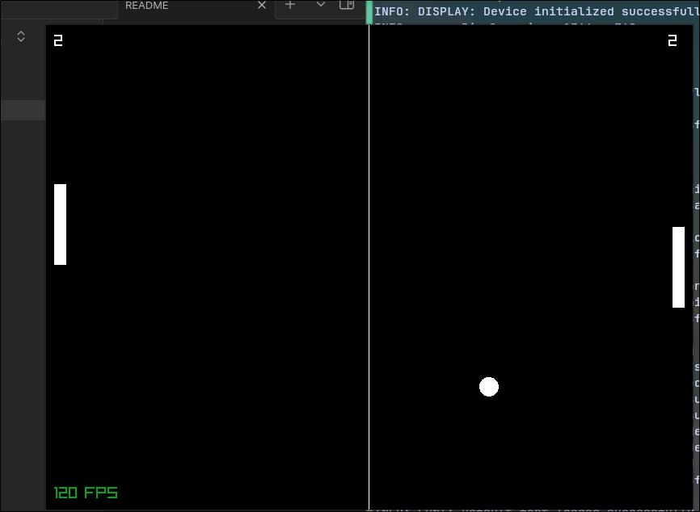

## Zong
Pong written in Zig with Raylib using Nix to set up the development environment with all the required packages/dependencies installed.

Nix can be installed on any operating system and the flake ensures that the version of dependencies stays the same because the
lock files locks down the version unless the flake is updated explicitly.

### Supported Platforms
Zong will work on any Linux distro running Wayland although you can most likely get it working on other platforms with little to no work.
- Windows
- MacOS
- Linux - Wayland only unless you can build it for X11 yourself which will require you to install the required X11 packages by
modifying [flake.nix](flake.nix) yourself. Remember that you have to modify [build.zig](build.zig) as well since it's hardcoded to build only
for the Wayland backend.
- And any other platforms that Zig and Raylib supports that I'm unaware of.

### How to Build
The ideal way to build and run Zong is to (install Nix)[https://nixos.org/download/] on your system and enter the development environment
by using the command ''nix develop'' in the root of the project directory. Then run ''zig build run'' to build and run the project.

Pass whatever flags you wish in order to choose what target to compile for and the optimization mode. Learn more about this from
(here)[https://ziglang.org/learn/build-system/] as I have no intentions to teach you about Nix and the Zig build system.
